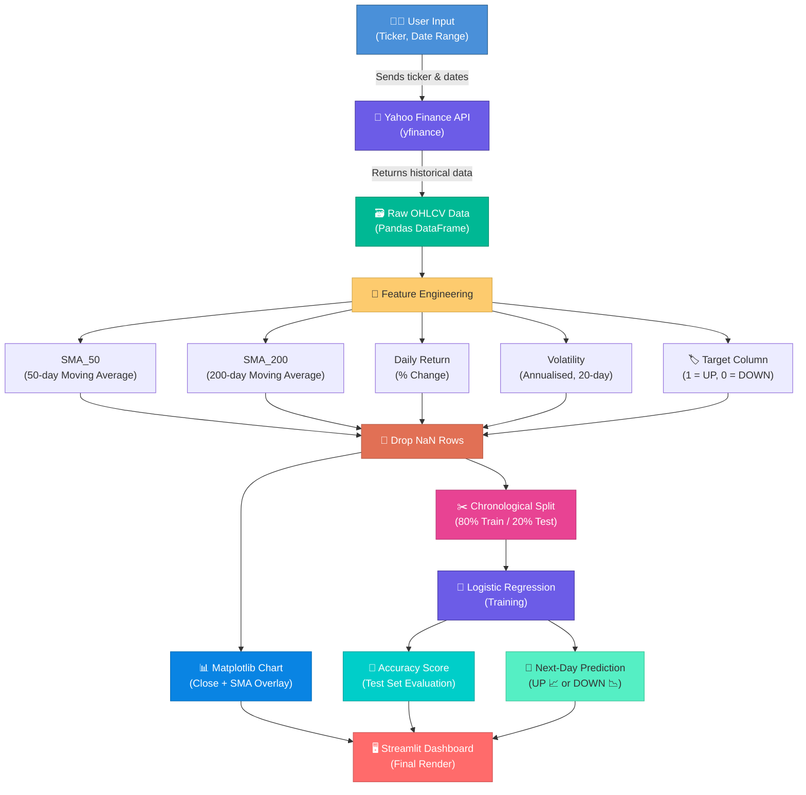

<div align="center">

# 📈 Quantitative Finance Dashboard

[](https://python.org)
[](https://streamlit.io)
[](https://scikit-learn.org)
[](https://pypi.org/project/yfinance/)
[](LICENSE)

**An interactive, real-time stock analysis dashboard powered by Machine Learning.**  
Fetch live market data · Visualise trends · Predict the next trading day's direction — all in one click.

---

</div>

## 📑 Table of Contents

| # | Section | Description |
|---|---------|-------------|
| 1 | [✨ Features](#-features) | What the dashboard can do |
| 2 | [🏗️ Project Workflow](#️-project-workflow) | End-to-end architecture diagram |
| 3 | [🛠️ Tech Stack](#️-tech-stack) | Libraries & frameworks used |
| 4 | [🚀 Quick Start](#-quick-start) | Get up and running in 60 seconds |
| 5 | [📂 Project Structure](#-project-structure) | Files & their roles |
| 6 | [🔬 How It Works](#-how-it-works) | Detailed step-by-step explanation |
| 7 | [📊 Screenshots](#-screenshots) | Live dashboard previews |
| 8 | [🤝 Contributing](#-contributing) | How to contribute |
| 9 | [⚠️ Disclaimer](#️-disclaimer) | Important legal notice |

---

## ✨ Features

| Feature | Description |
|---------|-------------|
| 🔴 **Live Market Data** | Pulls real OHLCV data from Yahoo Finance — no CSV uploads, no stale datasets. |
| 📉 **Moving Averages** | Computes the institutional-standard **50-day** and **200-day** Simple Moving Averages. |
| 📊 **Volatility Analysis** | Calculates annualised volatility via a 20-day rolling standard deviation. |
| 🎨 **Interactive Chart** | Matplotlib figure with Close price + SMA overlays, rendered inside Streamlit. |
| 🤖 **ML Prediction** | Logistic Regression model trained on a **chronological** 80/20 split (no data leakage). |
| 🔮 **Next-Day Forecast** | Predicts whether the stock will close **UP 📈** or **DOWN 📉** tomorrow. |
| ⚙️ **Sidebar Controls** | Change ticker, start date, and end date on the fly — the whole dashboard reacts instantly. |

---

## 🏗️ Project Workflow

> The diagram below shows the complete data pipeline — from user input to prediction output.



---

## 🛠️ Tech Stack

<div align="center">

| Library | Role | Version |
|---------|------|---------|
|  | Core language | 3.10+ |
|  | Web UI framework | 1.55 |
|  | Data manipulation | 2.x |
|  | Numerical computing | 2.x |
|  | Machine Learning | 1.x |
|  | Data visualisation | 3.x |
|  | Live market data | 0.2+ |

</div>

---

## 🚀 Quick Start

### Prerequisites

- **Python 3.10+** installed ([download](https://www.python.org/downloads/))
- **Git** installed ([download](https://git-scm.com/downloads))

### Installation

<details>
<summary><b>🪟 Windows</b></summary>

```powershell
# 1 — Clone the repository
git clone https://github.com/pr-ABHIGYAN001/FINANCE.git
cd FINANCE

# 2 — Create & activate virtual environment
python -m venv venv
venv\Scripts\activate

# 3 — Install dependencies
pip install -r requirements.txt

# 4 — Launch the dashboard 🚀
streamlit run app.py
```

</details>

<details>
<summary><b>🐧 macOS / Linux</b></summary>

```bash
# 1 — Clone the repository
git clone https://github.com/pr-ABHIGYAN001/FINANCE.git
cd FINANCE

# 2 — Create & activate virtual environment
python3 -m venv venv
source venv/bin/activate

# 3 — Install dependencies
pip install -r requirements.txt

# 4 — Launch the dashboard 🚀
streamlit run app.py
```

</details>

> 💡 The dashboard opens automatically at **http://localhost:8501**

---

## 📂 Project Structure

```
FINANCE/
├── 📄 app.py               # Main application — all logic in one file
├── 📄 requirements.txt     # Pinned Python dependencies
├── 📄 .gitignore           # Excludes venv/, __pycache__/, etc.
└── 📄 README.md            # You are here!
```

---

## 🔬 How It Works

<details>
<summary><b>Step 1 — Data Acquisition</b></summary>

The app calls `yf.download(ticker, start, end)` which hits the **Yahoo Finance API** and returns a Pandas DataFrame with daily **Open, High, Low, Close, Volume** data.

```python
raw_df = yf.download(ticker, start=start_date, end=end_date, progress=False)
```

</details>

<details>
<summary><b>Step 2 — Feature Engineering</b></summary>

Four technical indicators are computed:

| Feature | Formula | Why? |
|---------|---------|------|
| `SMA_50` | `Close.rolling(50).mean()` | Short-term trend direction |
| `SMA_200` | `Close.rolling(200).mean()` | Long-term trend direction |
| `Daily_Return` | `Close.pct_change()` | Single-day momentum |
| `Volatility` | `rolling(20).std() × √252` | Annualised risk measure |

A **Target** column is added:  
`1` if tomorrow's close > today's close (UP), else `0` (DOWN).

</details>

<details>
<summary><b>Step 3 — Visualisation</b></summary>

A Matplotlib figure plots **Close**, **SMA_50**, and **SMA_200** on the same axis so you can spot trend crossovers at a glance (e.g. the *golden cross* where SMA_50 crosses above SMA_200).

</details>

<details>
<summary><b>Step 4 — Machine Learning</b></summary>

- **Model**: Logistic Regression (binary classifier).
- **Split**: Chronological 80/20 — **no shuffling** to prevent future data from leaking into training.
- **Evaluation**: Accuracy score on the held-out test set.
- **Prediction**: The most recent row of features is fed into the model to predict tomorrow's direction.

```python
model = LogisticRegression(max_iter=1000)
model.fit(X_train, y_train)
next_day_pred = model.predict(X.iloc[[-1]])[0]
```

</details>

---

## 📊 Screenshots

<div align="center">

### Dashboard — Top View
> Title, sidebar controls, data preview, and price chart with SMA overlays.


### Dashboard — Bottom View
> Model accuracy metric, test set size, and the next-day UP/DOWN prediction banner.


</div>

> 💡 *Replace the placeholder links above with actual screenshots after deploying.*

---

## 🤝 Contributing

Contributions are welcome! Here's how:

1. **Fork** the repository
2. **Create** a feature branch — `git checkout -b feature/awesome-idea`
3. **Commit** your changes — `git commit -m "Add awesome idea"`
4. **Push** to the branch — `git push origin feature/awesome-idea`
5. **Open** a Pull Request

---

## ⚠️ Disclaimer

> **This dashboard is for educational purposes only and does NOT constitute financial advice.**  
> Past performance does not guarantee future results. Always consult a qualified financial advisor before making investment decisions.

---

<div align="center">

Made with ❤️ by [pr-ABHIGYAN001](https://github.com/pr-ABHIGYAN001)

⭐ **Star this repo** if you found it helpful!

</div>
